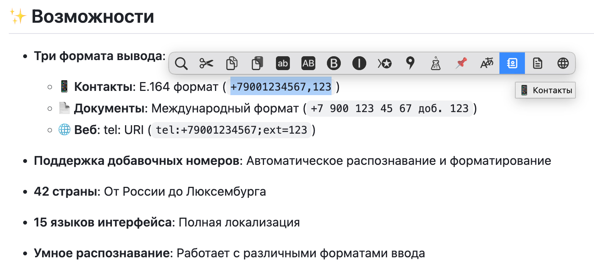

<p align="center">
  <a href="README.ru.md"></a>
  <a href="https://www.popclip.app/"></a>
  <a href="../../releases/latest"></a>
  <a href="LICENSE"></a>
</p>

<h1 align="center">📱 PopClip Phone Formatter</h1>

<p align="center">
  <strong>Intelligent phone number formatting for macOS</strong><br>
  <sub>Supports 42 countries • 15 languages • Extensions</sub>
</p>

---

## Features

**Three output formats:**

| Format | Output | Use Case |
|--------|--------|----------|
| 📱 **Contacts** | `+19175551234,123` | Address books, CRM |
| 📄 **Documents** | `+1 917 555 1234 ext. 123` | Emails, documents |
| 🌐 **Web** | `tel:+19175551234;ext=123` | Clickable links |

**Key capabilities:**

- ✅ Automatic extension detection (`ext.`, `x`, `#`, `доб.`)
- ✅ Smart parsing of messy input formats
- ✅ Validated against `libphonenumber-js`
- ✅ Modifier key: hold **Option (⌥)** to invert format
- ✅ Full fallback when library unavailable

## Screenshots

| Settings Panel | PopClip Menu |
|:--------------:|:------------:|
|  |  |

## Installation

1. Install [PopClip](https://pilotmoon.com/popclip/) (version 4200+)
2. Download `phone-formatter.popclipext` from [Releases](../../releases/latest)
3. Double-click to install
4. Set your default country in extension settings

## Usage

**Basic:**
1. Select any phone number
2. Click the desired format button

**Advanced:**
- Hold **Option (⌥)** when clicking **Documents** to invert format (intl ↔ natl)

### Supported Input Formats

| Input Type | Example |
|------------|---------|
| International | `+1 (917) 555-1234` |
| National | `(917) 555-1234` |
| Plain digits | `19175551234` |
| With extension | `+19175551234 ext. 123` |
| URI format | `tel:+19175551234` |
| Multiple plus signs | `++19175551234` |

### Output Examples

| Input | Contacts | Documents (intl) | Web |
|-------|----------|------------------|-----|
| `(917) 555-1234` | `+19175551234` | `+1 917 555 1234` | `tel:+19175551234` |
| `8 900 123 45 67` | `+79001234567` | `+7 900 123 45 67` | `tel:+79001234567` |
| `+44 20 7946 0958 x123` | `+442079460958,123` | `+44 20 7946 0958 ext. 123` | `tel:+442079460958;ext=123` |

## Supported Countries

<details>
<summary><strong>View all 42 countries</strong></summary>

| Country | Code | National Length | Ext. Length |
|---------|------|-----------------|-------------|
| 🇷🇺 Russia | +7 | 10 | 2-6 |
| 🇺🇸 United States | +1 | 10 | 2-6 |
| 🇬🇧 United Kingdom | +44 | 10 | 2-5 |
| 🇩🇪 Germany | +49 | 10-11 | 2-5 |
| 🇫🇷 France | +33 | 9 | 2-4 |
| 🇨🇳 China | +86 | 11 | 2-5 |
| 🇯🇵 Japan | +81 | 10 | 2-4 |
| 🇰🇷 South Korea | +82 | 9-10 | 2-5 |
| 🇧🇷 Brazil | +55 | 10-11 | 2-5 |
| 🇮🇳 India | +91 | 10 | 2-5 |
| 🇦🇺 Australia | +61 | 9 | 2-5 |
| 🇨🇦 Canada | +1 | 10 | 2-6 |
| 🇲🇽 Mexico | +52 | 10-11 | 2-4 |
| 🇮🇹 Italy | +39 | 9-11 | 2-4 |
| 🇪🇸 Spain | +34 | 9 | 2-4 |
| 🇳🇱 Netherlands | +31 | 9 | 2-4 |
| 🇵🇱 Poland | +48 | 9 | 2-4 |
| 🇹🇷 Turkey | +90 | 10 | 2-4 |
| 🇹🇭 Thailand | +66 | 9 | 2-4 |
| 🇻🇳 Vietnam | +84 | 9-10 | 2-4 |
| 🇸🇪 Sweden | +46 | 7-9 | 2-4 |
| 🇳🇴 Norway | +47 | 8 | 2-4 |
| 🇩🇰 Denmark | +45 | 8 | 2-4 |
| 🇫🇮 Finland | +358 | 9 | 2-4 |
| 🇦🇹 Austria | +43 | 10-11 | 2-4 |
| 🇨🇭 Switzerland | +41 | 9 | 2-4 |
| 🇧🇪 Belgium | +32 | 9 | 2-4 |
| 🇮🇪 Ireland | +353 | 9 | 2-4 |
| 🇵🇹 Portugal | +351 | 9 | 2-4 |
| 🇬🇷 Greece | +30 | 10 | 2-4 |
| 🇨🇿 Czech Republic | +420 | 9 | 2-4 |
| 🇭🇺 Hungary | +36 | 9 | 2-4 |
| 🇷🇴 Romania | +40 | 9 | 2-4 |
| 🇧🇬 Bulgaria | +359 | 8-9 | 2-4 |
| 🇭🇷 Croatia | +385 | 8-9 | 2-4 |
| 🇸🇮 Slovenia | +386 | 8 | 2-4 |
| 🇸🇰 Slovakia | +421 | 9 | 2-4 |
| 🇱🇹 Lithuania | +370 | 8 | 2-4 |
| 🇱🇻 Latvia | +371 | 8 | 2-4 |
| 🇪🇪 Estonia | +372 | 7-8 | 2-4 |
| 🇨🇾 Cyprus | +357 | 8 | 2-4 |
| 🇱🇺 Luxembourg | +352 | 9 | 2-4 |

</details>

## Localization

Interface available in 15 languages:

> English, Русский, Deutsch, Français, 中文, 日本語, Italiano, Español, Nederlands, Polski, Português (BR), 한국어, Tiếng Việt, Türkçe, Dansk

## Technical Details

<details>
<summary><strong>Architecture</strong></summary>

```
Input → Clean & Parse Extension → libphonenumber-js
                                        ↓
                                   isValid()?
                                   ┌────┴────┐
                                  YES        NO
                                   ↓          ↓
                             Format E.164   REJECT
                                   ↓
                        Format by type (contact/document/web)
                                   ↓
                          Add extension if present
```

**Validation flow:**
1. Clean input (remove garbage, fix `+++` → `+`)
2. Try `libphonenumber-js` parsing
3. If parsed but `isValid() = false` → reject
4. If exception → manual fallback for local formats
5. Format according to output type

</details>

<details>
<summary><strong>Dependencies</strong></summary>

- **Runtime**: [libphonenumber-js.min.js](https://unpkg.com/libphonenumber-js/bundle/libphonenumber-js.min.js) (bundled)
- **Platform**: PopClip 4200+
- **OS**: macOS 11+

</details>

## Contributing

1. Fork the repository
2. Create a feature branch (`git checkout -b feature/amazing-feature`)
3. Commit changes (`git commit -m 'Add amazing feature'`)
4. Push to branch (`git push origin feature/amazing-feature`)
5. Open a Pull Request

## Reporting Issues

Found a bug? Please [open an issue](../../issues) with:

- Input phone number
- Expected output
- Actual output
- PopClip version

## Changelog

### v2.5.1
- **Critical fix**: Numbers with `isValid()=false` now rejected (not fallback)
- Fixed handling of multiple plus signs (`++`, `+++`, etc.)
- Added Option (⌥) modifier for format inversion
- Improved country detection from country code
- 41/41 tests passing

<details>
<summary><strong>Previous versions</strong></summary>

### v2.4.0
- Added Option (⌥) modifier support
- Improved document formatting

### v2.3.0
- Added modifier key infrastructure
- Fixed extension parsing

</details>

## License

[MIT](LICENSE) © nikolalek

---

<p align="center">
  <sub>Made with ❤️ for the PopClip community</sub>
</p>
